<h1 align="center">Hi, I'm unStone 👋</h1>

  Full-stack dev in Hangzhou · Roguelike lover · Loves dogs, doesn't have one 🐕

  
  
  

---

### 🔭 What I'm building

| Project | What it is | Stack |
| --- | --- | --- |
| [**web-ppt**](https://github.com/unStone/web-ppt) | Pure-browser PPT rendering engine: `.pptx` / `.ppt` → unified JSON Schema → SVG. Zero server, zero framework, files never leave the browser. | TypeScript |
| [**dsh-xray**](https://github.com/unStone/dsh-xray) | X-ray for DeepSeek Harness plugins — declared capabilities vs. actual behavior. Registry + static scanner + badges. | Python |
| [**dsh-xray-plugin**](https://github.com/unStone/dsh-xray-plugin) | Ask what a DSH plugin can *actually* do, from inside your agent. Companion to `dsh-xray`. | TypeScript |
| [**ssstone-tools**](https://github.com/unStone/ssstone-tools) | The Swiss Army knife for developers. | TypeScript |
| [**ai-daily-podcast**](https://github.com/unStone/ai-daily-podcast) | AI 早报播客 — a daily AI-news podcast, generated end to end. | Automation |
| [**coi**](https://github.com/unStone/coi) | Continuous Optimization Interface — a personal toolbox that keeps iterating on itself. | Python |

### 🌱 Currently into

`AI agents & skills` · `Rust` · `ComfyUI` · `OOXML / rendering internals`

### 💬 Say hi

Got an idea worth building? Email me at **[386159234@qq.com](mailto:386159234@qq.com)** — I have plenty of my own, and they trade well.

---

  <picture>
    <source media="(prefers-color-scheme: dark)" srcset="./profile/stats-dark.svg">
    
  </picture>
  <picture>
    <source media="(prefers-color-scheme: dark)" srcset="./profile/top-langs-dark.svg">
    
  </picture>

  Cards are regenerated daily by <a href="./.github/workflows/readme-cards.yml">GitHub Actions</a> and committed as static SVGs — no third-party runtime.

📈 My activity across GitHub

 

[Issues](https://github.com/search?q=author%3AunStone+is%3Aissue&type=issues) ·
[Issue comments](https://github.com/search?q=commenter%3AunStone) ·
[Pull requests](https://github.com/search?q=author%3AunStone+is%3Apr+-user%3AunStone&type=issues) ·
[Discussions](https://github.com/discussions?discussions_q=author%3AunStone) ·
[Discussion comments](https://github.com/discussions?discussions_q=commenter%3AunStone)

